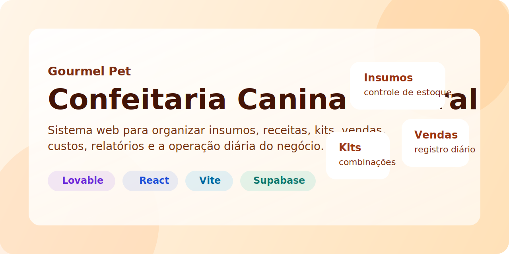
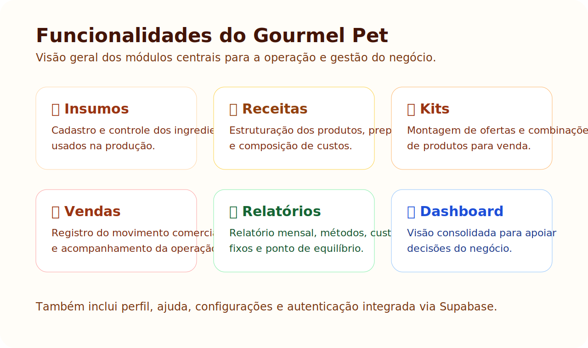
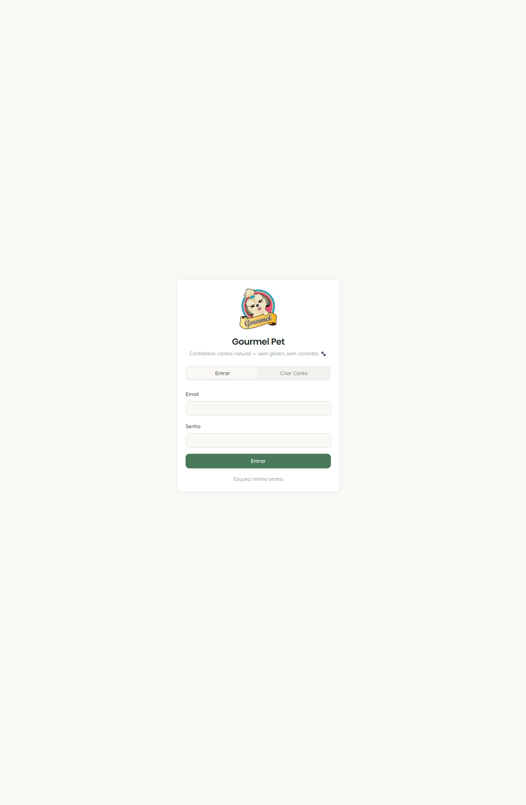
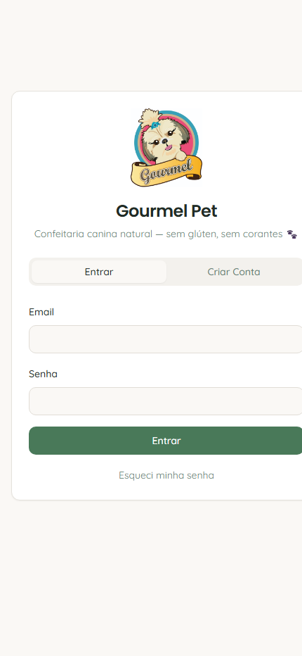

  

<h1 align="center">Gourmel Pet</h1>

  Plataforma digital para apoiar a gestão, organização e crescimento de uma operação de <strong>confeitaria canina natural</strong>.

  
  
  
  
  

---

## Visão do projeto

O **Gourmel Pet** nasce como uma base digital para profissionalizar a operação de uma confeitaria canina natural, trazendo mais organização, previsibilidade e inteligência para a rotina do negócio.

Mais do que um sistema de controle, a proposta é criar uma plataforma que conecte operação, gestão e visão estratégica, permitindo crescimento com mais consistência.

### Links principais

- **Aplicação online:** <https://thyagoapolinario.github.io/gourmel-78427910/>
- **Repositório:** <https://github.com/ThyagoApolinario/gourmel-78427910>

---

## Oportunidade

Negócios artesanais e especializados costumam crescer apoiados em processos manuais, planilhas dispersas e controles operacionais fragmentados. Isso gera retrabalho, reduz visibilidade financeira e dificulta decisões mais rápidas.

O Gourmel Pet se posiciona como um passo importante nessa profissionalização, estruturando dados e processos que hoje são críticos para a eficiência e a expansão do negócio.

---

## Proposta de valor

O projeto busca entregar valor em três camadas principais:

### 1. Eficiência operacional

- melhor organização de insumos, receitas, kits e vendas
- redução de controles paralelos e dispersos
- maior clareza para a rotina do negócio

### 2. Gestão e decisão

- leitura mais clara de custos, relatórios e ponto de equilíbrio
- acompanhamento de indicadores centrais da operação
- base melhor para decisões comerciais e operacionais

### 3. Crescimento estruturado

- digitalização da operação
- base para novas funcionalidades e integrações
- possibilidade de evolução para uma plataforma mais robusta no futuro

---

## O que já existe no produto

  

### Funcionalidades atuais

- **Gestão de insumos**
- **Receitas e composição**
- **Kits e estrutura de oferta**
- **Registro de vendas**
- **Relatórios e indicadores**
- **Custos fixos e ponto de equilíbrio**
- **Dashboard operacional**
- **Perfil, ajuda e configurações**

---

## Screenshots reais da aplicação

<table>
  <tr>
    <td width="65%" valign="top">
      
    </td>
    <td width="35%" valign="top">
      
    </td>
  </tr>
</table>

As capturas acima mostram a interface real publicada do projeto, atualmente na etapa de acesso/autenticação da plataforma.

---

## Por que isso importa para parceiro, investidor ou aliado comercial

O Gourmel Pet já demonstra alguns sinais importantes de maturidade de produto:

- existe uma **estrutura funcional real**, não apenas uma ideia conceitual
- há uma **base digital publicada**, navegável e versionada
- o projeto já está organizado para continuar evoluindo com agilidade
- o problema atacado é concreto: operação, gestão e visibilidade do negócio

Para parceiros e apoiadores, isso significa olhar para um projeto que já saiu do campo abstrato e entrou em uma fase de consolidação de produto.

---

## Roadmap estratégico

### Curto prazo

- refinar o fluxo de acesso e onboarding
- melhorar a experiência visual e a comunicação do produto
- evoluir indicadores essenciais da operação
- aprimorar usabilidade mobile

### Médio prazo

- expandir relatórios e visão executiva
- fortalecer apoio à decisão comercial
- evoluir gestão de receitas, kits e custos
- ampliar a robustez operacional da plataforma

### Longo prazo

- domínio próprio e posicionamento mais forte de marca
- automações e integrações adicionais
- camadas mais avançadas de inteligência de negócio
- expansão do produto para uma operação mais escalável

---

## Base tecnológica

- **React**
- **Vite**
- **TypeScript**
- **Supabase**
- **Tailwind CSS**

---

## Publicação e versionamento

Este projeto está:

- sincronizado com o **Lovable**
- versionado no **GitHub**
- publicado no **GitHub Pages**

---

## Licenciamento

Este projeto é **proprietário**.

- **Todos os direitos reservados** a Thyago Apolinário
- **nenhum direito de uso é concedido** sem autorização prévia e expressa por escrito
- é vedado usar, copiar, modificar, redistribuir, sublicenciar, comercializar ou criar derivados sem permissão formal
- a disponibilização pública do repositório **não** representa concessão de licença, autorização de exploração ou cessão de direitos

Consulte o arquivo `LICENSE` para os termos completos.

---

## Observação importante

Este repositório está conectado ao Lovable. Para evitar problemas de sincronização, o ideal é **não renomear nem mover este repositório**.
